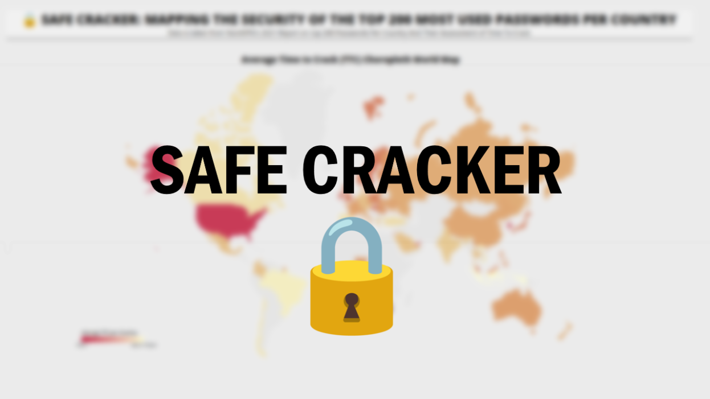

# SafeCracker 
SafeCracker is an interactive data visualization based on NordVPN's top 200 passwords per country in 2021. 

This project was done as part of a Computer Visualization Project in CPSC 447 at the University of British Columbia
